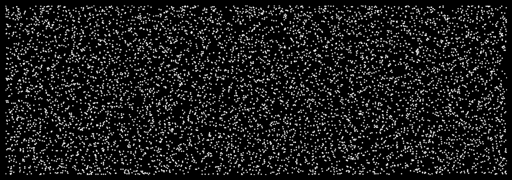

# LOGO evolve  

A pet project to have a LOGO appear and disappear using a cloud of randomly moving points. An example of the outcome is shown below:

    

Click the link above or  to see the logo evolve and highlight some of the morphing processes implemented here.
